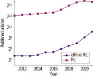

# Offline RL Survey: Supplementary Material
This is the supplementary material to accompany the article titled "A Survey on Offline Reinforcement Learning: Taxonomy, Review, and Open Problems" available in [arXiv](https://arxiv.org/abs/2203.01387).

## Setup
To run the scripts that generate the artifacts in this repo, make sure to install the required packages:
```sh
pip install -r requirements.txt
```
We used `python3.8` in our setup, so we advise anyone trying to run the scripts to use a version `>=3.8`.

## Popularity of the Field
To gauge the popularity of offline RL, we measured the number of published articles in offline RL and RL over the past decade (from 2011-2021) according to Google Scholar.
For the offline RL articles, we included those that have either the offline RL or batch RL keywords.
We found the following results.



Notice how both offline RL and RL have increased in popularity over the past years.
However, offline RL has consistently shown exponential growth over the past five years, while RL has decreased in popularity in 2021.
The figure above is generated from the CSV output from the following command:

```sh
python crawl_pubs.py
```

The artifact output from the script is also available in the repo under the `assets` folder as [`pubs.csv`](assets/pubs.csv).

## Method Performance
In the table below, we present the normalized scores for various methods on the D4RL benhcmark.
The normalized score is computed to facilitate comparison across tasks.
Fu et al. normalize the scores roughly between 0 and 100, where 0 corresponds to the average score of an agent taking actions uniformly at random and 100 is the score of a domain-specific expert.
For Maze2D and Flow, the expert performance corresponds to the hand-designed controller used to collect data.
AntMaze, FrankaKitchen, and CARLA use an estimate of the highest score possible based on the designated task.
In Adroit, this corresponds to a policy trained with behavior cloning and fine-tuned with online RL.
Finally, for Gym-MuJoCo, the performance of an agent trained with SAC is used as reference.

| method                    | SAC   | SAC-off | BC    | 10%BC | BEAR  | BRACp | BRACv | AWR   | BCQ   | AlgaeDICE | DT    | TT    | AWAC | ORL   | TDBC  | CQL   | FBRC  | RvSg | RvSr  | IQL   | COMBO | MOPO | MOReL |
|---------------------------|-------|---------|-------|-------|-------|-------|-------|-------|-------|-----------|-------|-------|------|-------|-------|-------|-------|------|-------|-------|-------|------|-------|
| maze2d-umaze              | 62.7  | 88.2    | 3.8   | ---   | 3.4   | 4.7   | -16.0 | 1.0   | 12.8  | -15.7     | ---   | ---   | ---  | ---   | ---   | 5.7   | ---   | ---  | ---   | ---   | ---   | ---  | ---   |
| maze2d-medium             | 21.3  | 26.1    | 30.3  | ---   | 29.0  | 32.4  | 33.8  | 7.6   | 8.3   | 10.0      | ---   | ---   | ---  | ---   | ---   | 5.0   | ---   | ---  | ---   | ---   | ---   | ---  | ---   |
| maze2d-large              | 2.7   | -1.9    | 5.0   | ---   | 4.6   | 10.4  | 40.6  | 23.7  | 6.2   | -0.1      | ---   | ---   | ---  | ---   | ---   | 12.5  | ---   | ---  | ---   | ---   | ---   | ---  | ---   |
| antmaze-umaze             | 0.0   | 0.0     | 54.6  | 60.0  | 73.0  | 50.0  | 70.0  | 56.0  | 78.9  | 0.0       | 59.2  | 100.0 | 56.7 | 64.3  | 78.6  | 74.0  | ---   | 65.4 | 64.4  | 87.5  | ---   | ---  | ---   |
| antmaze-umaze-diverse     | 0.0   | 0.0     | 45.6  | 46.5  | 61.0  | 40.0  | 70.0  | 70.3  | 55.0  | 0.0       | 53.0  | ---   | 49.3 | 60.7  | 71.4  | 84.0  | ---   | 60.9 | 70.1  | 62.2  | ---   | ---  | ---   |
| antmaze-medium-play       | 0.0   | 0.0     | 0.0   | 42.1  | 0.0   | 0.0   | 0.0   | 0.0   | 0.0   | 0.0       | 0.0   | 93.3  | 0.0  | 0.3   | 10.6  | 61.2  | ---   | 58.1 | 4.5   | 71.2  | ---   | ---  | ---   |
| antmaze-medium-diverse    | 0.0   | 0.0     | 0.0   | 37.2  | 8.0   | 0.0   | 0.0   | 0.0   | 0.0   | 0.0       | 0.0   | 100.0 | 0.7  | 0.0   | 3.0   | 53.7  | ---   | 67.3 | 7.7   | 70.0  | ---   | ---  | ---   |
| antmaze-large-play        | 0.0   | 0.0     | 0.0   | 28.0  | 0.0   | 0.0   | 0.0   | 0.0   | 6.7   | 0.0       | 0.0   | 66.7  | 0.0  | 0.0   | 0.2   | 15.8  | ---   | 32.4 | 3.5   | 39.6  | ---   | ---  | ---   |
| antmaze-large-diverse     | 0.0   | 0.0     | 0.0   | 34.3  | 0.0   | 0.0   | 0.0   | 0.0   | 2.2   | 0.0       | 0.0   | 60.0  | 1.0  | 0.0   | 0.0   | 14.9  | ---   | 36.9 | 3.7   | 47.5  | ---   | ---  | ---   |
| halfcheetah-random        | 100.0 | 30.5    | 2.3   | 2.0   | 25.1  | 24.1  | 31.2  | 2.5   | 2.2   | -0.3      | 2.2   | ---   | ---  | 6.9   | 11.0  | 18.6  | 33.3  | ---  | 3.9   | ---   | 38.8  | 35.4 | 25.6  |
| hopper-random             | 100.0 | 11.3    | 4.8   | 4.1   | 11.4  | 11.0  | 12.2  | 10.2  | 10.6  | 0.9       | 7.5   | ---   | ---  | 7.8   | 8.5   | 9.3   | 11.3  | ---  | -0.2  | ---   | 17.9  | 11.7 | 53.6  |
| walker2d-random           | 100.0 | 4.1     | 1.7   | 1.7   | 7.3   | -0.2  | 1.9   | 1.5   | 4.9   | 0.5       | 2.0   | ---   | ---  | 6.1   | 1.6   | 2.5   | 1.5   | ---  | 7.7   | ---   | 7.0   | 13.6 | 37.3  |
| halfcheetah-medium        | 100.0 | -4.3    | 42.6  | 42.5  | 41.7  | 43.8  | 46.3  | 37.4  | 40.7  | -2.2      | 42.6  | 46.9  | 43.5 | 55.6  | 48.3  | 49.1  | 41.3  | ---  | 41.6  | 47.4  | 54.2  | 42.3 | 42.1  |
| hopper-medium             | 100.0 | 0.9     | 52.9  | 56.9  | 59.1  | 77.5  | 81.1  | 17.4  | 53.1  | 0.3       | 67.6  | 61.1  | 57.0 | 83.3  | 59.3  | 64.6  | 99.4  | ---  | 60.2  | 66.3  | 97.2  | 28.0 | 95.4  |
| walker2d-medium           | 100.0 | 0.8     | 75.3  | 75.0  | 52.1  | 32.7  | 31.1  | 35.9  | 54.5  | 1.2       | 74.0  | 79.0  | 72.4 | 85.6  | 83.7  | 82.9  | 78.8  | ---  | 71.7  | 78.3  | 81.9  | 17.8 | 77.8  |
| halfcheetah-medium-replay | 100.0 | -2.4    | 36.6  | 40.6  | 38.6  | 45.4  | 47.7  | 40.3  | 38.2  | -2.1      | 36.6  | 41.9  | 40.5 | 42.4  | 44.6  | 47.3  | 43.2  | ---  | 38.0  | 44.2  | 55.1  | 53.1 | 40.2  |
| hopper-medium-replay      | 100.0 | 1.9     | 18.1  | 75.9  | 19.2  | -0.3  | 0.9   | 15.5  | 15.0  | 0.6       | 82.7  | 91.5  | 37.2 | 71.0  | 60.9  | 97.8  | 41.8  | ---  | 73.5  | 94.7  | 89.5  | 67.5 | 93.6  |
| walker2d-medium-replay    | 100.0 | 3.5     | 26.0  | 62.5  | 33.7  | 0.6   | 0.6   | 28.4  | 33.1  | 1.1       | 66.6  | 82.6  | 27.0 | 71.6  | 81.8  | 86.1  | 35.6  | ---  | 60.6  | 73.9  | 56.0  | 39.0 | 49.8  |
| halfcheetah-medium-expert | 100.0 | 1.8     | 55.2  | 92.9  | 53.4  | 44.2  | 41.9  | 52.7  | 64.7  | -0.8      | 86.8  | 95.0  | 42.8 | 93.5  | 90.7  | 85.8  | 93.3  | ---  | 92.2  | 86.7  | 90.0  | 63.3 | 53.3  |
| hopper-medium-expert      | 100.0 | -0.1    | 52.5  | 110.9 | 40.1  | 76.9  | 81.6  | 53.8  | 57.5  | 0.4       | 107.6 | 110.0 | 55.8 | 102.1 | 98.0  | 102.0 | 105.2 | ---  | 101.7 | 91.5  | 111.1 | 23.7 | 108.7 |
| walker2d-medium-expert    | 100.0 | 1.6     | 107.5 | 109.0 | 96.3  | 1.9   | 0.8   | 27.1  | 110.9 | 1.1       | 108.1 | 101.9 | 74.5 | 110.9 | 110.1 | 109.5 | 112.4 | ---  | 106.0 | 109.6 | 103.3 | 44.6 | 95.6  |
| kitchen-complete          | 0.0   | 15.0    | 65.0  | ---   | 0.0   | 0.0   | 0.0   | 0.0   | 8.1   | 0.0       | ---   | ---   | ---  | ---   | ---   | 43.8  | ---   | 50.2 | 1.5   | 62.5  | ---   | ---  | ---   |
| kitchen-partial           | 0.6   | 0.0     | 38.0  | ---   | 13.1  | 0.0   | 0.0   | 15.4  | 18.9  | 0.0       | ---   | ---   | ---  | ---   | ---   | 49.8  | ---   | 60.3 | 1.1   | 46.3  | ---   | ---  | ---   |
| kitchen-mixed             | 0.0   | 2.5     | 51.5  | ---   | 47.2  | 0.0   | 0.0   | 10.6  | 8.1   | 2.5       | ---   | ---   | ---  | ---   | ---   | 51.0  | ---   | 51.4 | 0.5   | 51.0  | ---   | ---  | ---   |
| pen-human                 | 21.6  | 6.3     | 63.9  | ---   | -1.0  | 8.1   | 0.6   | 12.3  | 68.9  | -3.3      | ---   | ---   | ---  | ---   | ---   | 37.5  | ---   | ---  | ---   | 71.5  | ---   | ---  | ---   |
| hammer-human              | 0.2   | 0.5     | 1.2   | ---   | 0.3   | 0.3   | 0.2   | 1.2   | 0.5   | 0.3       | ---   | ---   | ---  | ---   | ---   | 4.4   | ---   | ---  | ---   | 1.4   | ---   | ---  | ---   |
| door-human                | -0.2  | 3.9     | 2     | ---   | -0.3  | -0.3  | -0.3  | 0.4   | -0.0  | -0.0      | ---   | ---   | ---  | ---   | ---   | 9.9   | ---   | ---  | ---   | 4.3   | ---   | ---  | ---   |
| relocate-human            | -0.2  | 0.0     | 0.1   | ---   | -0.3  | -0.3  | -0.3  | -0.0  | -0.1  | -0.1      | ---   | ---   | ---  | ---   | ---   | 0.2   | ---   | ---  | ---   | 0.1   | ---   | ---  | ---   |
| pen-cloned                | 21.6  | 23.5    | 37    | ---   | 26.5  | 1.6   | -2.5  | 28.0  | 44.0  | -2.9      | ---   | ---   | ---  | 60.0  | ---   | 39.2  | ---   | ---  | ---   | 37.3  | ---   | ---  | ---   |
| hammer-cloned             | 0.2   | 0.2     | 0.6   | ---   | 0.3   | 0.3   | 0.3   | 0.4   | 0.4   | 0.3       | ---   | ---   | ---  | 2.1   | ---   | 2.1   | ---   | ---  | ---   | 2.1   | ---   | ---  | ---   |
| door-cloned               | -0.2  | 0.0     | 0.0   | ---   | -0.1  | -0.1  | -0.1  | 0.0   | 0.0   | 0.0       | ---   | ---   | ---  | 0.4   | ---   | 0.4   | ---   | ---  | ---   | 1.6   | ---   | ---  | ---   |
| relocate-cloned           | -0.2  | -0.2    | -0.3  | ---   | -0.3  | -0.3  | -0.3  | -0.2  | -0.3  | -0.3      | ---   | ---   | ---  | -0.1  | ---   | -0.1  | ---   | ---  | ---   | -0.2  | ---   | ---  | ---   |
| pen-expert                | 21.6  | 6.1     | 85.1  | ---   | 105.9 | -3.5  | -3.0  | 111.0 | 114.9 | -3.5      | ---   | ---   | ---  | ---   | ---   | 107.0 | ---   | ---  | ---   | ---   | ---   | ---  | ---   |
| hammer-expert             | 0.2   | 25.2    | 125.6 | ---   | 127.3 | 0.3   | 0.3   | 39.0  | 107.2 | 0.3       | ---   | ---   | ---  | ---   | ---   | 86.7  | ---   | ---  | ---   | ---   | ---   | ---  | ---   |
| door-expert               | -0.2  | 7.5     | 34.9  | ---   | 103.4 | -0.3  | -0.3  | 102.9 | 99.0  | 0.0       | ---   | ---   | ---  | ---   | ---   | 101.5 | ---   | ---  | ---   | ---   | ---   | ---  | ---   |
| relocate-expert           | -0.2  | -0.3    | 101.3 | ---   | 98.6  | -0.3  | -0.4  | 91.5  | 41.6  | -0.1      | ---   | ---   | ---  | ---   | ---   | 95.0  | ---   | ---  | ---   | ---   | ---   | ---  | ---   |
| flow-ring-controller      | 100.7 | 9.2     | -57.0 | ---   | 62.7  | -12.3 | -91.2 | 75.2  | 76.2  | 15.2      | ---   | ---   | ---  | ---   | ---   | 52.0  | ---   | ---  | ---   | ---   | ---   | ---  | ---   |
| flow-ring-random          | 100.7 | 70.0    | 94.9  | ---   | 103.5 | 95.7  | 78.6  | 80.4  | 94.6  | 83.6      | ---   | ---   | ---  | ---   | ---   | 87.9  | ---   | ---  | ---   | ---   | ---   | ---  | ---   |
| flow-merge-controller     | 121.5 | 111.6   | 114.1 | ---   | 150.4 | 129.8 | 143.9 | 152.7 | 114.8 | 196.4     | ---   | ---   | ---  | ---   | ---   | 157.2 | ---   | ---  | ---   | ---   | ---   | ---  | ---   |
| flow-merge-random         | 121.5 | -40.1   | -17.1 | ---   | -20.6 | 146.2 | 27.3  | 99.6  | 28.2  | 4.7       | ---   | ---   | ---  | ---   | ---   | 40.6  | ---   | ---  | ---   | ---   | ---   | ---  | ---   |
| carla-lane                | -0.8  | 0.1     | 31.8  | ---   | -0.2  | 18.2  | 19.6  | -0.4  | -0.1  | -1.2      | ---   | ---   | ---  | ---   | ---   | 20.9  | ---   | ---  | ---   | ---   | ---   | ---  | ---   |
| carla-town                | 1.4   | -1.8    | -1.8  | ---   | -2.7  | -4.6  | -2.6  | 1.9   | 1.9   | -11.2     | ---   | ---   | ---  | ---   | ---   | -2.6  | --    | ---  | ---   | ---   | ---   | ---  | ---   |


This table was used to compute the relative scores we used in the performance heatmap from from Figure 6 in the survey paper and replicated below.
The heatmap aggregates the per-dataset scores into average relative scores for each dataset property.
This allows us to make high-level decisions more easily and answer questions like "What is the best algorithm for a dataset with properties X and Y?"


 To generate the CSV artifacts used to create the heatmap and compute its colors, one can run the following command from the root of the repository (after installing the necessary requirements):
 ```sh
 python scores.py
 ```

## Bibtex
```
@misc{prudencio2022offlinerlsurvey,
    title={A Survey on Offline Reinforcement Learning: Taxonomy, Review, and Open Problems}, 
    author={Rafael Figueiredo Prudencio and Marcos R. O. A. Maximo and Esther Luna Colombini},
    year={2022},
    eprint={2203.01387},
    archivePrefix={arXiv},
    primaryClass={cs.LG},
}
```
